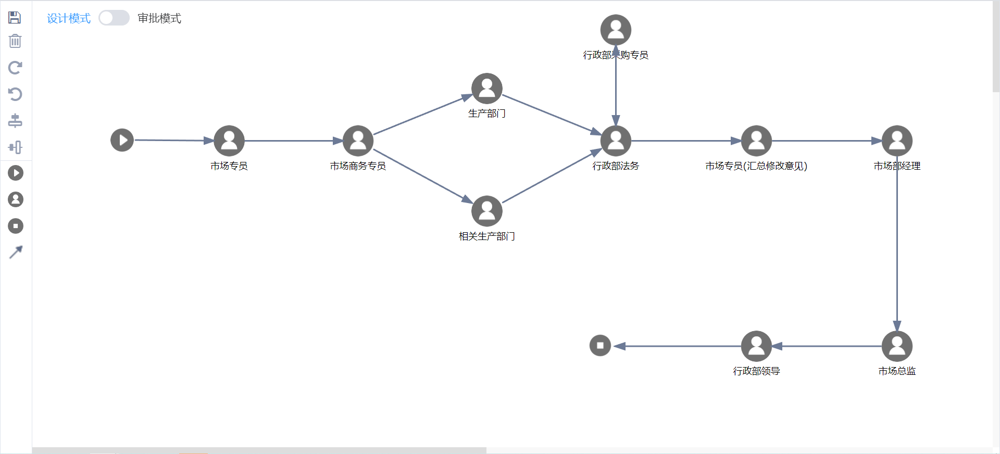
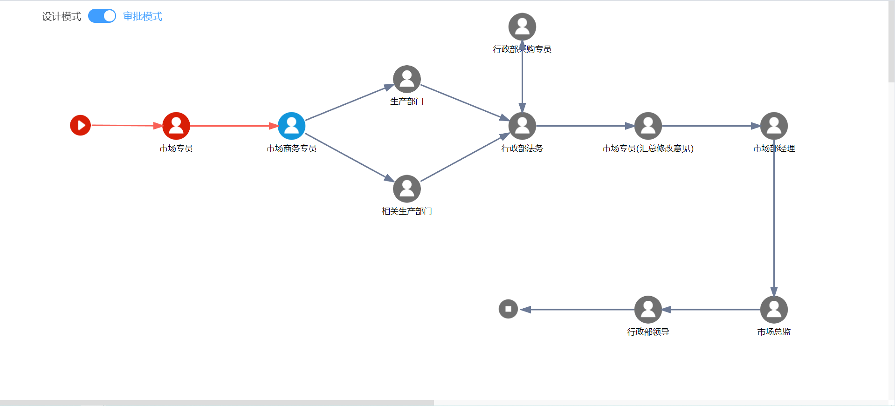

## 前言
越来越多的企业都在研发低代码平台，其中流程引擎是核心之一，拥有一个可以拖拽设计审批流程的设计器是相当重要的。

## 介绍
审批流程设计器是一种工具，用于创建和设计审批流程。它通常是一个可视化的设计器界面，可以方便地添加和配置审批节点、终审节点、消息节点等，并能够通过连线将这些节点连接起来，构造流程图的整体框架。
在审批流程设计器中，可以定义审批流程的各种属性和行为，例如审批节点的工作流引擎、审批路径、审批人、审批时间等等。设计完成后，可以将审批流程部署到实际的应用环境中，实现自动化审批和流程管理。

## 使用场景
审批流程设计器的使用范围非常广泛，可以应用于各种需要进行审批的场景，如财务报销、请假申请、采购订单等等。通过审批流程设计器，可以提高审批效率、减少人工干预、加强流程透明度等。

## 功能
1、支持拖拽设计流程；
2、支持节点和流向线添加、删除、修改、查看属性等操作；
3、支持单人节点和多人节点配置；
4、支持流转策略配置和角色配置；
5、属性弹窗支持插槽自定义；
6、支持审批预览模式，不同颜色代表不同状态等功能。

## 截图
### 设计模式

### 审批预览模式

